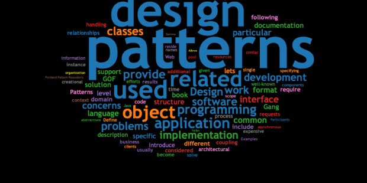

Patterns are something very prevalent in the world. They can be seen on buildings, furnitures, background colorschemes, etc. In addition, patterns can be found in not only aesthetics, but in other ways such as a person's habits, weather behavior, and even problems in general.

### Patterns in problems

The word 'problems' may not be the first thing that comes to mind when thinking about patterns. However, many common inventions that are present in today's society were created in order to deal with common problems, ones that would happen again and again such as how a pattern repeats itself. This then leads into the development of design patterns. 

Christopher Alexander once said that a design pattern:

<blockquote>
 "describes a problem that occurs over and over again in our environment, and then describes the core of the solution to that problem, in such a way that you an use this solution a million times over, without ever doing it the same way twice." -Christopher Alexander, 1977
</blockquote>

A common area where design patterns can be used is in software development. The reusable general solutions from design patterns can be used when designing software. This can be done by applying them to frequent or reccuring problems as well as performing general tasks such as creating objects or managing them.

### Personal Patterns

Design patterns are extremely useful and although I was previously unaware of it, I have in fact been using them in code I've written. At the top of my head, one design pattern I've used would be the Observer design pattern. Through using the Observer design pattern it allows me to create a relationship from one object to many others. It then makes it so that objects can be updated when their connected object is changed. An interesting analogy I've found that describes this incredibly well can be found on [Medium](https://medium.com/educative/the-7-most-important-software-design-patterns-d60e546afb0e).

<blockquote>
 "...think about what happens when you follow someone on Twitter. You are essentially asking Twitter to send you (the observer) tweet updates of the person (the subject) you followed. The pattern consists of two actors, the observer who is interested in the updates and the subject who generates the updates." -The Educative Team via Medium
</blockquote>

Another design pattern I've applied in my code is the Adapter design pattern. This design pattern helps to adapt or translate incompatible classes in order to allow them to work together. An example of this would be when trying to use an output of say type A and translating or adapting it so that it can be inputted into a source that requires type B input.

### Future Thoughts

Design patterns are an important part of software development and I believe there is still a lot for me to learn and understand. In the future I hope to deepen my knowledge on the topic and become more familiar with different design patterns. In addition, since it seems like design patterns are a common interview questions I look forward to one day being prepared and confident about talking about design patterns if the scenario ever occurs to me. 
