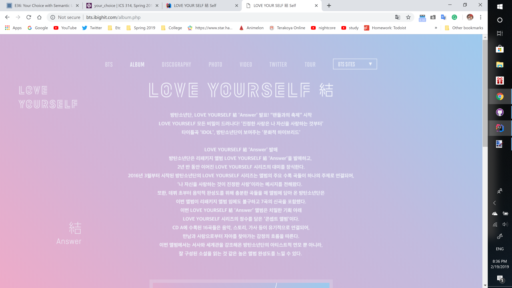
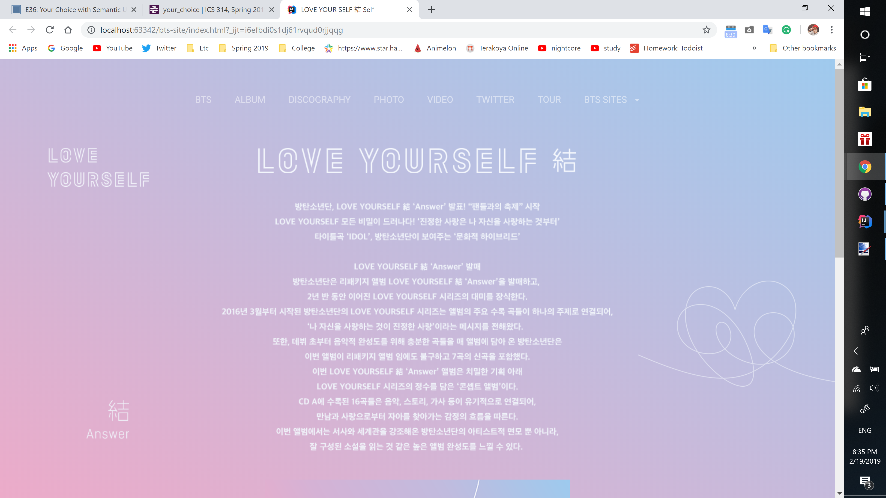

Recently I was introduced to UI Frameworks (User Interface Frameworks). Previously when using [IntelliJ Idea](https://www.jetbrains.com/idea/) to create websites it was through writing pure HTML and CSS code. Now, however, I'm learning how to use [Semantic UI](https://semantic-ui.com/) and incorporating it into my code. 

### Tricky Hurdles Encountered

Although I'm now using Semantic UI to create websites, it was just a couple weeks ago that I learned how the how-tos and rules for HTML/CSS. Due to that, I sometimes still have to look things up in order to make sure I'm using the right syntax for my code. Adding in Semantic UI which is even newer to me adds to that even further. 

Just today I had to recreate a website for an in-class timed assignment and I was struggling because parts of my site weren't coming out how I intended them to be. It was only after closely looking through each line of code that I realized slight word variations as well as spelling mistakes in my code that wasn't caught by IntelliJ Idea as an error. An example of both can be seen below.

My code:
```
<div class="ui centered aligned container"> // Incorred word variation
font stlye: italic; //Spelling Error
```

What it was supposed to be:

```
<div class="ui center aligned container">
font stlye: italic;
```

In addition, using Semantic UI is a bit tricky due to the many different things that can be done with it. Since I'm still a beginner to using it I'm only familiar with specific parts of Semantic UI that I've had to use in previous assignments such as columns and menus. With just a glance at their site however, there are plenty of other things that Semantic UI can be used for such as pop-ups, steps, reveals, etc. It's a little intimidating but I'm looking forward to trying out those other elements in order to create better websites.

### Amazing Re-creation Ability

With using only HTML/CSS I wasn't incredibly impressed with the websites I was making. They didn't look well-made and if I had clicked on a link to a site like that I probably would have closed out of it just based on the appearance. However, Semantic UI has blown my mind due to how much more professional my sites have turned out. In a previous assignment for my ICS 314: Software Engineering class we were required to choose a website and copy it the best we could using Semantic UI. Below are pictures showing the original site I used as well as the one I created to mimic it.

Original Site:




My Re-Creation of the Site:



In addition, I've also looked at my fellow classmates' re-creations of their chosen sites and it's only helped to further my amazement for Semantic UI.

### Final Thoughts

<blockquote>
 "Semantic is a development framework that helps create beautiful, responsive layouts using human-friendly HTML." -Semantic UI Homepage
</blockquote>

Semantic UI truly delivers on its declaration. Not only does it help to create websites that are visually appealing and professional looking, it also does so in a user-friendly way that makes the process much easier. Although I'm still getting used to it and working through difficulties, with time and practice I hope to become skilled in using Semantic UI to create eye-catching websites efficiently. In addition, due to my introduction to UI Frameworks through Semantic UI, I'm interested in learning more about other UI Frameworks and seeing if I can use them to broaden my skillset.


