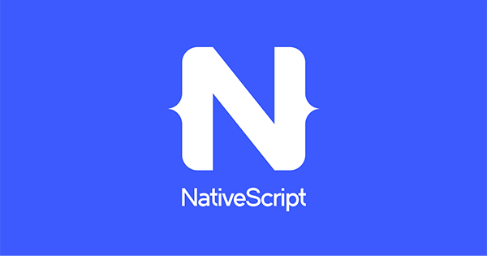

There are many options for those looking to create a mobile application. Of those options, React Native, Flutter, and NativeScript are popular frameworks that can be used in order to create mobile applications. 

## Framework Descriptions

### React Native

[React Native](https://reactnative.dev/) was released by Facebook. It’s written in JavaScript and is rendered with native code. It features fast builds and loads which allows developers to see changes immediately after saving their code. Popular apps that use React Native include Facebook, Instagram, Pinterest, and Discord. It is also seen as the most popular option for building mobile applications with a large community.

GitHub Stats:
* Used by 398k
* Starred by 87.4k
* 20,207 commits
* 2,105 contributors

### NativeScript

[NativeScript](https://www.nativescript.org/) has an accessible and beautiful platform-native UI. It also allows direct access to all iOS and Android APIs. NativeScript uses JavaScript/TypeScript, CSS, and Native UI markup for developing applications. In addition, it offers free plugins, application samples, and templates on their marketplace. 

GitHub Stats:
* Used by 12.2k
* Starred by 18.5k
* 6,068 commits
* 169 contributors

### Flutter

[Flutter](https://flutter.dev/) was created by Google. It is used to create mobile, web, and desktop applications. Flutter features fast development which allows for sub-second reload times. It also has a flexible and expressive UI that allows for full customization. Organizations like Google, New York Times, and BMW have built apps using Flutter. Instead of JavaScript, it uses the Dart programming language.

GitHub Stats:
* Starred by 92.8k
* 18,895 commits
* 600 contributors

## Personal Thoughts For CSExplore’s Framework

[CSExplore](https://radgrad.github.io/docs/csexplore/goals) is a mobile application that aims to encourage interest and involvement in Computer Science for high-school students. Of the frameworks listed above, I think that React Native would be the best choice to use for CSExplore. I believe that all of the members have experience with React which would make developing with React Native a bit easier compared to other frameworks. 

In addition, React Native is a very popular framework that is used by highly-popular apps such as Facebook and Instagram. Although I’m not completely familiar with React Native, I’m familiar with those apps, what they look like and how they work. This leads me to believe that apps created with React Native are very capable and user-friendly.
