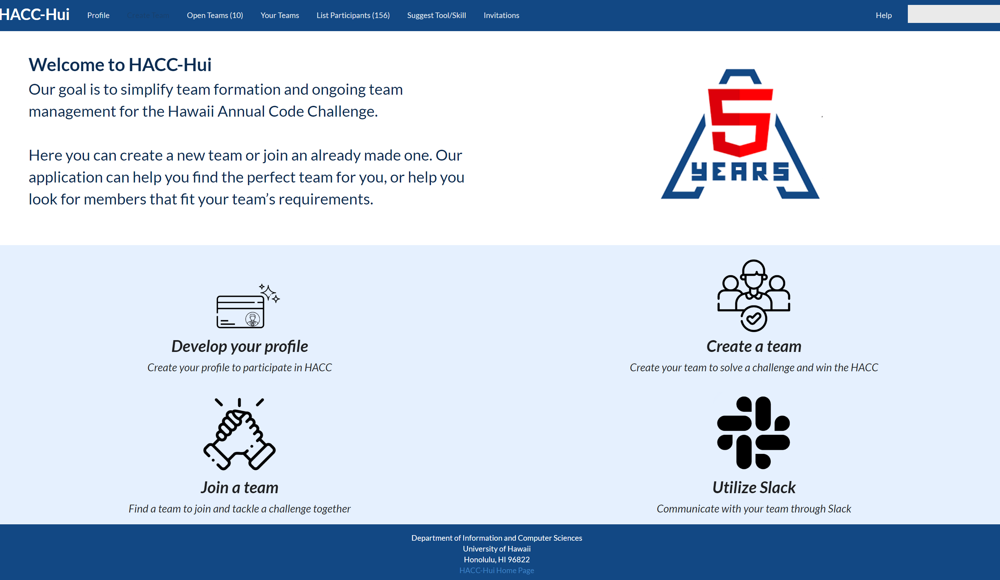
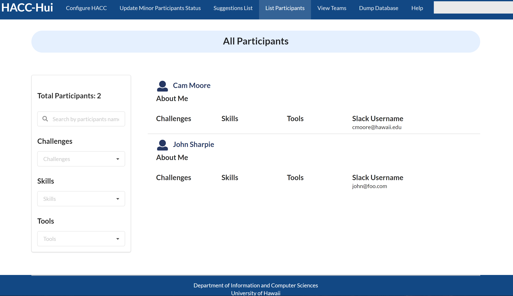
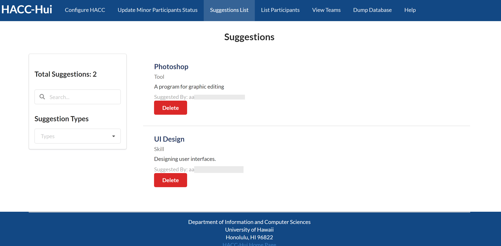

[RadGrad](https://radgrad.ics.hawaii.edu/) is an online website dedicated to helping develop computer scientists. It does this by helping undergraduate students discover their interests and prepare for their future as well as assisting them in defining and achieving their career goals.

## HACC-Hui Introduction

[HACC-Hui](https://hacchui.ics.hawaii.edu/) is an online web application that was used to improve team formation for the 2020 [Hawaii Annual Code Challenge](https://hacc.hawaii.gov/). Through this web application, participants were able to create their own profile where they can link their social networking information, the challenges they’re interested in, and the skills and tools they have to offer teams. In addition, participants could either create or join a team through HACC-Hui. If they created a team they could invite participants to join while if they were looking to join a team they could view a list of teams that are open for recruitment and the challenge(s) the team was interested in completing.

Throughout development I participated in creating and improving different parts of the web application. I assisted in the creation of the home page. The design itself was a combination of mine and my teammate’s figma mock-up designs. This was decided through voting and consideration through our team discussion channel on discord. After this was decided I took on the task of turning the figma mock-up into code. At this time of the development process there were different groups working in parallel to create the web application. Out of all the home pages created my team’s home page was chosen and was used as the home page for HACC-Hui.

I also added a ‘List Participants’ page for the site administrators. This page is only accessible to the site administrators. It shows a list of all of the participants who have signed up on HACC-Hui. On this page, the administrators are also able to filter the list of participants. One way this can be done by typing the participant’s name in the search bar. They can also select one or more skills, tools, or challenges from the labeled drop down menus and have the participant list filtered that way. The skills, tools, challenges section also allows for the administrators to type and filter the selected option, making it easier for them to choose instead of having to scroll through all of the options.

Another functionality I added was the ‘Suggest a New Tool or Skill’ feature. On the participant’s side, it allows for them to submit either a tool or a skill. Once submitted, the web application takes in the type (either tool or skill) as well as the name and description of the tool/skill they want to suggest. This is then stored in a database and becomes available for the administrators to view. On the administrator’s side, there is a page where they can view all of the tool and skill suggestions made. From this page, they will be able to see the suggestion type, the email of the participant who suggested it, as well as the name and description of the suggested tool/skill. It also features a delete button and a filter to allow for easy navigation for the administrators.

While the project was split into five teams working in parallel with each other, I worked with a team of four other members: [Nadine](https://nadine-alcantara.github.io/), [Justin](https://justinhwong.github.io/), [Christine](https://cyuehara.github.io/), and [Newton](https://newtonics.github.io/). Our team was named [LevelUpTeamA](https://github.com/LevelUpTeamA/HACC-Hui1) because our team assignment was Team A. For the first milestone I worked with Justin on the Configure HACC user story. This involved creating the Configure HACC-Hui page which would be used by administrators to view the challenges, skills, and tools available for participants. On this page, the administrators would also be able to edit or delete challenges, skills, and tools or add new ones.

During milestone two I worked on improving the admin configuration page due to some errors that were occurring with the ‘interests’ data that was connected to the ‘challenges’ displayed on the HACC-Configuration page. For milestone 3 I planned to work on the ‘invite all team members’ user story. However, this milestone ended up being interrupted due to the difficulty of combining the parallel repositories all five groups created. This led to the transfer of all students working on a single repository which can be viewed [here](https://github.com/HACC-Hui/HACC-Hui). Overall, besides the assigned work throughout the milestones I was also active in the team discord channel. I offered help with debugging to my teammates when they were struggling and offering suggestions and feedback as well. In fact, on the discord server leaderboard which tracks the amount of messages sent, I am currently in first place with 370 messages sent.

ICS 414 was a very new and interesting experience. I loved the feeling of working on an application I knew would be deployed and used by other people for a specific purpose. Having the class’s communication platform as Discord was very convenient and easy to use. I was very comfortable talking with my teammates and classmates through the application and was able to be easily notified whenever there were new messages since I’m an active Discord user. The format of the class, although new and unfamiliar, was very easy to understand. I liked using milestones and user stories to separate the different work and it made assigning tasks much easier. 

Since there was a semester gap between taking ICS 314 and ICS 414 I had to review during the beginning of the semester to re-familiarize myself with javascript, react, meteor, and semantic-ui. Also, the collections system was a bit different from what had been taught during the semester I took for ICS 314 so I had to relearn how the pages worked too. On a personal note, I struggled slightly with time management which sometimes resulted in rushing to complete my assigned tasks before the deadline.

In conclusion, I learned a lot of different skills from this class and gained valuable new experiences. I increased my knowledge on javascript, react, semantic-ui, and meteor throughout this process. I also learned a little about slack api and event subscriptions. Through this class I also gained more experience with understanding code and debugging, especially since that was a common problem when working with the HACC-Hui collections. Overall, I enjoyed working on HACC-Hui and grateful I was able to contribute to this project.
