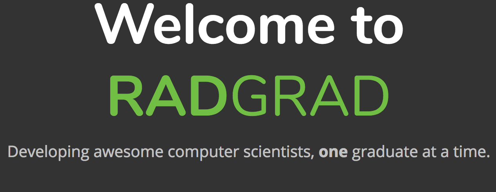

[RadGrad](https://radgrad.ics.hawaii.edu/) is an online website dedicated to helping develop computer scientists. It does this by helping undergraduate students discover their interests and prepare for their future as well as assisting them in defining and achieving their career goals.

## Re-Introduction

I was first introduced to RadGrad during my sophomore year. Updating my RadGrad degree planner was part of an assignment I had for a class. This led me to thoroughly exploring RadGrad and what kind of features were available on the site. During my first look through the website, I found it quite easy to use and navigate as well as being full of a lot of helpful information. However, after completing the mentioned assignment I lacked interest or reason to return to the site up until recently.

Due to my involvement in CSExplore which is a part of RadGrad I’ve once again directed my attention towards the site. Some parts of the site that caught my eye are the recommended sections and teasers. I’m unsure if these were features that were present when I was first introduced to RadGrad but I found them useful and interesting. Although I am now entering my senior year in the fall I think these would be very helpful for a freshman who’s just starting their computer science degree. In addition, I noticed videos on a couple of ICS courses, namely ICS 361 and ICS 432. In the case of the former, I recently took ICS 361 during the past semester and so I found the video entertaining. As for the latter, I plan to take ICS 432 in the Fall so the video was helpful in letting me know what kind of topics we’ll be going into and what kinds of things we’ll do.

## Leveling Up In RadGrad

RadGrad has a feature where students can level up by gaining points. These points are separated into three different categories: Innovation, Competency, and Experience. Upon my return to RadGrad I noticed I was level 2. In order to level up to level 3 I found that I needed to gain Innovation and Experience points. To do this I checked through what unverified opportunities I had on my degree planner. From there, I realized I could get Innovation and Experience points for my participation in [ACM Manoa](https://acmanoa.github.io/about/), a student organization at UH Manoa for computer science students. From here, I requested verification through the degree planner and shortly afterwards I was able to gain points and level up. 

## Possible Changes

Although I think RadGrad is a very helpful site I think there are possible improvements that could be made. One possible improvement could be to link RadGrad with Star which would make it easier for students working on their degree planner. By doing so, students’ planned courses would already be inputted and they’d just have to arrange what opportunities they’d want to pursue.

Another possible improvement could be towards the mentor space. Upon looking through the space it seems very sparse and unused but I like the idea of it. I think besides having professional mentors an option could be to have student mentors for example junior or senior computer science students. This way students can possibly ask questions about courses they want to take in the future and what kind of things they can expect to learn or for tips if they're struggling in the class.

Leading off of that, if permission is given from students, I think being able to see what courses and opportunities other students have taken could be a nice feature. This way newer students can see what potential paths they can take from what their seniors have done. If possible, new students could also somehow contact older students if they have questions regarding the opportunities or courses they’ve participated in.

In addition, I think that having teaser videos of ICS courses is also a good feature that could be expanded on. The teaser videos are informational and may also be easier to digest rather than reading a block of text. Although it may be difficult to make videos for all courses a possible option could be to offer a small contest for students where they make teaser videos for an ICS course they are taking or have taken in the past. This could attract students to watch each other’s videos, possibly vote for them, and therefore lead to them interacting with the RadGrad site (and maybe gain points for participating either by voting or submitting a video). Videos made from this could also be kept on the site so they can be watched by students in the future who are looking to take those courses.

## A Rad RadGrad

Overall I think RadGrad is a good site but it seems to lack an active userbase. A lot of course review sections for classes and opportunities are either empty or outdated. Despite that, there is still a lot of helpful and useful information for students. I think students may be more inclined to come back to RadGrad if we’re able to consistently provide them new content and information.
