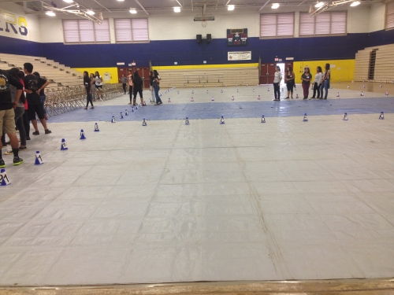
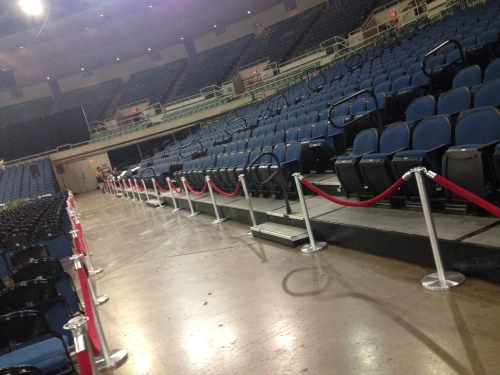

At the high school I attended, part of the set-up a preparation for the graduation ceremony was done by the grade level student councils. During my sophomore year of high school I was selected to be a Grand Usher for the following year's graduation.

That same year I shadowed the current year's Grand Ushers along with two others in order to prepare myself for the following year. The duties of a grand usher include leading the Graduation Usher meetings attended by the student council members. We were also required to assign positions (i.e. aisle guard, processional leaders, diploma distributor) to all of the ushersed to assign positions and make preparations to ensure the graduation practice and graduation ceremony ran smoothly.

Through this experience I learned how to be thorough and meticulous because nothing could be allowed to go wrong on the day of the ceremony. I also gained experience with working under stress and pressure as well as being creative and quick-witted. On that day, any problems that occured had to be solved to the best degree possible and slip-ups were not tolerated.

