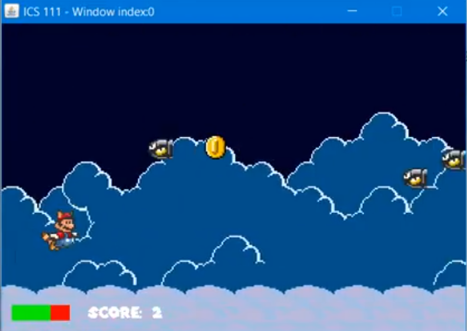

Mario Flight Simulator is a game that I helped to create during my ICS 111 class along with two others. For our final project we had to work in groups to create a program that helped to demonstrate our understanding of everything we learned that semester.

The Mario Flight Simulator was written using java code along the [EZ Library](http://www2.hawaii.edu/~dylank/ics111/). We were given a little over a month for the whole process: brainstorming the program idea, distributing roles, coding, and debugging. 

Through this project I experienced what it's like to code in a team setting. This includes sharing code and making sure everyone's code within the team is updated whenever changes are made. Also, I was able to practice writing Java code in a bigger scale in comparison to the homework and in-class assignments given throughout the semester.

Here is a [link](https://www.youtube.com/watch?v=7Q8WPcMoNAA) to a video showcasing the game.
